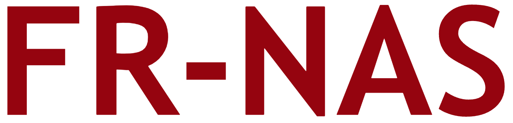

<br/>
<p align="center"></p>

----

# On the Importance of Architectures and Hyperparameters for Fairness in Face Recognition [[arxiv]](https://arxiv.org/)
<p align="center"></p>

# Table of contents
- [Setup](#setup)
- [Download datasets](#download)
- [Download raw data files](#download_raw)
- [Create Configs](#create_configs)
- [Taining and evaluation](#train&eval)
- [Joint NAS+HPO](#jointnashpo)
    - [Search](#search)
    - [Training](#training)
    - [Analysis](#analysis2)
# Setup <a name="setup"></a>
To setup your environment use the commands below:
```
git clone https://github.com/dooleys/FR-NAS/
cd FR-NAS
conda create --name frnas python=3.9.11
conda activate frnas
pip install -r requirements.txt
```

# Download datasets
| Dataset  |     Download link     | Split  | 
|----------|:-------------:|:-------------:|
| [CelebA](https://arxiv.org/pdf/1411.7766.pdf) | [download](https://drive.google.com/drive/folders/0B7EVK8r0v71pWEZsZE9oNnFzTm8?resourcekey=0-5BR16BdXnb8hVj6CNHKzLg) | Train-Val-Test |
| [RFW](https://arxiv.org/pdf/1812.00194.pdf) | [download](http://www.whdeng.cn/RFW/index.html)| Test |
| [VGGFace2](https://arxiv.org/pdf/1710.08092.pdf) | [download](https://drive.google.com/file/d/1jdZw6ZmB7JRK6RS6QP3YEr2sufJ5ibtO/view)  | Train/Test |
# Analysis of Fairness for Architectures <a name="archs"></a>

### To create configuration files needed to train all the models we study run: <a name="create_configs"></a>

```
bash scripts/create_configs.sh
```

### Then to train and evaluate all the models we study run the following commands: <a name="experiments1"></a>

 ```
bash scripts/experiments_default.sh
bash scripts/experiments_multi.sh
```

### Analysis <a name="analysis1"></a>


To train a model based on the created configs execute the following command
 ```
 python src/fairness_train_timm.py --config_path <your_config_path> 
  ```
 
 ```
 python src/fairness_train_timm.py --config_path configs/ghostnet_100/config_ghostnet_100_MagFace_Adam.yaml
```
 
 ```
 python src/fairness_train_timm.py --config_path configs/vgg19/config_vgg19_MagFace_SGD.yaml
  ```

To create the config files from a list of commands, run:

 ```
  bash ./phase1b_xxxxxx.sh

 ```


# Joint NAS+HPO <a name="jointnashpo"></a>
## Search <a name="search"></a>
## Training<a name="training"></a>
## Analysis <a name="analysis2"></a>
