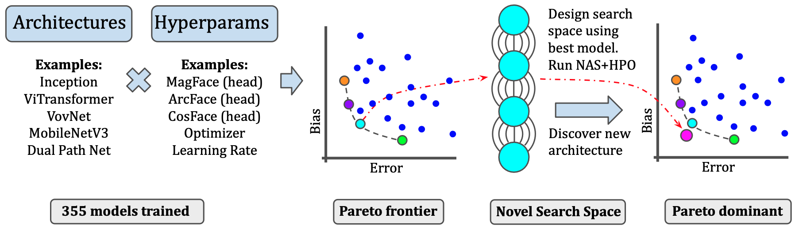

 

----

### On the Importance of Architectures and Hyperparameters for Fairness in Face Recognition

Face recognition systems are deployed across the world by government agencies and contractors for sensitive and impactful tasks, such as surveillance and database matching.  Despite their widespread use, these systems are known to exhibit bias across a range of sociodemographic dimensions, such as gender and race.  Nonetheless, an array of works proposing pre-processing, training, and post-processing methods have failed to close these gaps. Here, we take a very different approach to this problem, identifying that both architectures and hyperparameters of neural networks are instrumental in reducing bias. We first run a large-scale analysis of the impact of architectures and training hyperparameters on several common fairness metrics and show that the implicit convention of choosing high-accuracy architectures may be suboptimal for fairness. Motivated by our findings, we run the first neural architecture search for fairness, jointly with a search for hyperparameters. We output a suite of models which Pareto-dominate all other competitive architectures in terms of accuracy and fairness. Furthermore, we show that these models transfer well to other face recognition datasets with similar and distinct protected attributes. We release our code and raw result files so that users can replace our fairness metrics with a bias measure of their choice. 

# Table of contents
1. [Create Configs](#CreateConfigs)
2. [Training](#Training)
2. [Batch Scripts](#BatchScripts)

# Create Configs 

To create config files for a model, execute the following command. Make sure to pass your chosen hyperparams as command line arguments as described in the example below:
<code> python create_configs.py --user_config <path_to_user_config> --backbone <backbone> --batch_size <batch_size> </code> 
 
<code> python create_configs.py --user_config config_user.yaml --backbone  ghostnet_100 --batch_size 64</code>
 
<code> python create_configs.py --user_config config_user.yaml --backbone vgg19 --batch_size 64 --lr 0.01 --momentum 0.9 --weight-decay 1e-4 --sched step --lr-cycle-decay 0.1 </code>

# Training 

To train a model based on the created configs execute the following command
<code>python src/fairness_train_timm.py --config_path <your_config_path> </code> 
 
<code>python src/fairness_train_timm.py --config_path configs/ghostnet_100/config_ghostnet_100_MagFace_Adam.yaml </code>
 
<code> python src/fairness_train_timm.py --config_path configs/vgg19/config_vgg19_MagFace_SGD.yaml </code> 

# Batch Scripts 

To create the config files from a list of commands, run:

 <code> bash ./phase1b_xxxxxx.sh</code>

To then create the Phase1b(ii) and Phase1b(iii) training commands, run:

 <code>bash ./make_phase1bii.sh > phase1bii.sh</code>
 
<code>bash ./make_phase1biii.sh > phase1biii.sh</code>
