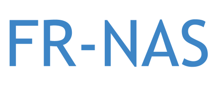

<br/>
<p align="center"></p>

----

# Rethinking Bias Mitigation: Fairer Architectures Make for Fairer Face Recognition [[arxiv]](https://arxiv.org/) - NeurIPS 2023 (<em>Oral</em>)
<p align="center"></p>

# Table of contents
- [Setup](#setup)
- [Download datasets](#download)
- [Download raw data files](#download_raw)
- [Create Configs](#create_configs)
- [Taining and evaluation](#train&eval)
- [Joint NAS+HPO](#jointnashpo)
    - [Search](#search)
    - [Training](#training)
    - [Analysis](#analysis2)
- [Evaluation with pre-trained models](#evaluation)
# Setup <a name="setup"></a>
To setup your environment use the commands below:
```
git clone https://github.com/dooleys/FR-NAS/
cd FR-NAS
conda create --name frnas python=3.9.11
conda activate frnas
pip install -r requirements.txt
```

# Download datasets <a name="download"></a>
## Create configs <a name="create_configs"></a>
| Dataset  |     Download link     | Split  | 
|----------|:-------------:|:-------------:|
| [CelebA](https://arxiv.org/pdf/1411.7766.pdf) | [download](https://drive.google.com/drive/folders/0B7EVK8r0v71pWEZsZE9oNnFzTm8?resourcekey=0-5BR16BdXnb8hVj6CNHKzLg) | Train-Val-Test |
| [RFW](https://arxiv.org/pdf/1812.00194.pdf) | [download](http://www.whdeng.cn/RFW/index.html)| Test |
| [VGGFace2](https://arxiv.org/pdf/1710.08092.pdf) | [train](https://drive.google.com/file/d/1jdZw6ZmB7JRK6RS6QP3YEr2sufJ5ibtO/view)-[test](https://www.kaggle.com/datasets/greatgamedota/vggface2-test?resource=download)  | Train-Test |
| [AgeDB](https://ibug.doc.ic.ac.uk/media/uploads/documents/agedb.pdf) | [download](https://www.dropbox.com/s/mkjsyqytd5lcai9/AgeDB.zip?dl=0) | Test |
| [LFW](http://vis-www.cs.umass.edu/lfw/) | [download](https://github.com/ZhaoJ9014/face.evoLVe#Data-Zoo) | Test |
| [CFP_FF](http://cfpw.io/paper.pdf) | [download](https://github.com/ZhaoJ9014/face.evoLVe#Data-Zoo) | Test |
| [CFP_FP](http://cfpw.io/paper.pdf) | [download](https://github.com/ZhaoJ9014/face.evoLVe#Data-Zoo) | Test |
| [CALFW](http://whdeng.cn/CALFW/?reload=true) | [download](https://github.com/ZhaoJ9014/face.evoLVe#Data-Zoo) | Test |
| [CPLPW](http://whdeng.cn/CPLFW/index.html?reload=true) | [download](https://github.com/ZhaoJ9014/face.evoLVe#Data-Zoo) | Test | 

Note: Folder ```splits/``` contains the identities used in the train-val-test split for CelebA and VGGFace2. Please use these files to create the necessary splits from the downloaded data. 

If you want to compute disparities across agegroups on the agedb dataset prepare the dataset following instructions [here](https://github.com/dooleys/FR-NAS/blob/main/agedb/prepare_agedb_groups.md)

# Large-scale study of fairness of architectures <a name="archs"></a>
The set of experiments below are for the large-scale analysis we conduct for architectures and their biases. This study is a driving force to motivate the use of NAS and HPO in the next experiments. 
## Modify user configs <a name="user_configs"></a>

After downloading the datasets above change the dataset and metadata paths in ```user_configs/config_user_celeba.yaml``` and ```user_configs/config_user_vgg.yaml``` to their respective locations. If you want to use comet for logging make sure you set the appropriate username and api key in these config files. 

## Create configs <a name="create_configs"></a>


```
bash scripts/create_configs_celeba.sh
bash scripts/create_configs_vgg.sh
```


## Train and evaluate architectures <a name="train&eval"></a> 
### CelebA
 ```
bash scripts/experiments_default_celeba.sh
bash scripts/experiments_multi_celeba.sh
```
### VGGFace2
 ```
bash scripts/experiments_default_vgg.sh
bash scripts/experiments_multi_vgg.sh
```

## Analysis <a name="analysis1"></a>
# Joint NAS+HPO <a name="jointnashpo"></a>
After the large-scale analysis we design a search space inspired by the Dual-Path-Network (DPN) and perform joint NAS and HPO using bayesian optimization in the [SMAC](https://github.com/automl/SMAC3) framework.  

Before running the search make sure to change the dataset paths and the user configs in ```search_configs/config_celeba.yaml``` and ```search_configs/config_vggface.yaml```. Then follow the following steps sequentially
## Search <a name="search"></a>
### Launch the scheduler
 ```
sbatch scripts/scheduler_dpn.sh
```
### Initialize the workers
Note: Launch the workers after the scheduler has started. Launch as many workers as you want by submitting the script below multiple times. 
 ```
sbatch scripts/workers_dpn.sh
```

### Start the distributed search
Note: You need to start schedulers and workers separately for search on CelebA and VGGFace2
 ```
sbatch scripts/job_celeba.sh
sbatch scripts/job_vgg.sh
```
### Other NAS methods

#### Search
To run other NAS methods like NSGA-II and MO-ASHA (on VGGFace2) use the following commands
```python
python src/search/search_nsga.py
python src/search/search_moasha.py
```
#### Train from scratch
To run other NAS methods like NSGA-II and MO-ASHA (on VGGFace2) use the following commands
```python
python src/search/train_synetune_archs.py --config moasha
python src/search/train_synetune_archs.py --config nsga2
```
## Training<a name="training"></a>
Train architectures discovered on CelebA
```python
python src/search/train_smac_arch_celeba.py --seed 111 --config config1
python src/search/train_smac_arch_celeba.py --seed 111 --config config2
```

Train architecture discovered on VGGFace2
```python
python src/search/train_smac_arch_vgg.py --seed 111 
```
## Analysis <a name="analysis2"></a>
After all the training and testing scripts are finished, use the `analysis/analysis.py` script to analyze the performance of the models. The anlysis centers on assembling a list of all the file paths into a list and passing that and the associated metadata to functions which perform the analysis and aggregate them into a dataframe. For example, if all your model output files live in pickle files in the subdirectories of the `output/` folder, obtain the accuracy, error, disparity, rank disparity, ratio, rank ratio, and error ratio dataframes here:
```python
files = glob.glob('output/**/*.pkl')
metadata = pd.read_csv(f'vggface/vggface2_val_identities_gender.csv')

acc_df_vgg, acc_disp_df_vgg, rank_df_vgg = analyze_pickle_files(files, metadata)
_, acc_disp_ratio_df_vgg, rank_ratio_df_vgg = analyze_pickle_files(files, metadata, ratio=True)
err_df, error_ratio_df, _ = analyze_pickle_files(files, metadata, ratio=True, error=True)                
```

The results for our training and testing runs can be found in the csvs in the `analysis/` folder. There is also the notebook `Paper_plots.ipynb` which reproduces the main figures in the paper. 


# Comparison with Fairness Baselines <a name="baselines"></a>
## Angular
```python
python src/baselines/smac_dpn_trainer_angular_celeba.py --seed 111 
python src/baselines/smac_dpn_trainer_angular_vgg.py --seed 111 
```

## Label Flip
```python
python src/baselines/smac_dpn_trainer_flip_celeba.py --seed 111 
python src/baselines/smac_dpn_trainer_flip_vgg.py --seed 111 
```

## SensitiveNets
```python
python src/baselines/smac_dpn_trainer_discriminator_celeba.py --seed 111 
python src/baselines/smac_dpn_trainer_discriminator_vgg.py --seed 111 
```
# Evaluation on FR Benchmarks <a name="evaluation"></a>

You can download our pretrained models from [here](https://drive.google.com/drive/folders/1HSLZw2cBd3KTLI-apxIUoq4WI2zkDksK?usp=sharing) and save it it your current directory. To evaluate the models on different face recognition benchmarks:
## VGGFace2
```python
python src/evaluation/eval_fr.py --backbone smac_301 --optimizer SGD --dataset vggface2 --head CosFace
python src/evaluation/eval_fr.py --backbone dpn107  --optimizer SGD --dataset vggface2 --head CosFace
python src/evaluation/eval_fr.py --backbone dpn107  --optimizer AdamW --dataset vggface2 --head CosFace
python src/evaluation/eval_fr.py --backbone rexnet_200 --optimizer SGD --dataset vggface2 --head CosFace
```

## CelebA
```python
python src/evaluation/eval_fr.py --backbone smac_000 --optimizer SGD --dataset celeba --head CosFace
python src/evaluation/eval_fr.py --backbone smac_010 --optimizer SGD --dataset celeba --head CosFace
python src/evaluation/eval_fr.py --backbone smac_680 --optimizer SGD --dataset celeba --head CosFace
python src/evaluation/eval_fr.py --backbone dpn107 --optimizer SGD --dataset celeba --head CosFace
python src/evaluation/eval_fr.py --backbone dpn107 --optimizer SGD --dataset celeba --head MagFace
```

# Bibtex
If this repo is helpful to you, please consider to cite it. Thank you! :)
```bibtex
@inproceedings{fair-nas-2023,
  title={Rethinking Bias Mitigation: Fairer Architectures Make for Fairer Face Recognition},
  author={Dooley, Samuel and Sukthanker, Rhea and Dickerson, John P and White, Colin and Hutter, Frank and Goldblum, Micah},
  booktitle={Advances in Neural Information Processing Systems},
  year={2023},
} 
```

# Acknowledgements
Our training and evaluation pipelines are inspired from [face.evoLVe](https://github.com/ZhaoJ9014/face.evoLVe)
